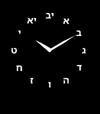

# Glyph Dial

Glyph Dial is a minimalist Hebrew analog watchface for Pebble Time 2 and Pebble Round 2.

It uses Hebrew dial markers, long tapered hands, and a monochrome layout designed to feel like a real watch rather than a gadget skin.

Built for the Spring 2026 Pebble app contest.



## Features

- Hebrew glyph dial markers
- Monochrome analog layout
- Long tapered baton hands
- Small outlined center hub
- No seconds and no date for a calmer v1 design

## Supported Platforms

- Emery / Pebble Time 2
- Gabbro / Pebble Round 2

## Build

```sh
pebble build
```

The generated app bundle is written to `build/pebble-watchface.pbw`.
